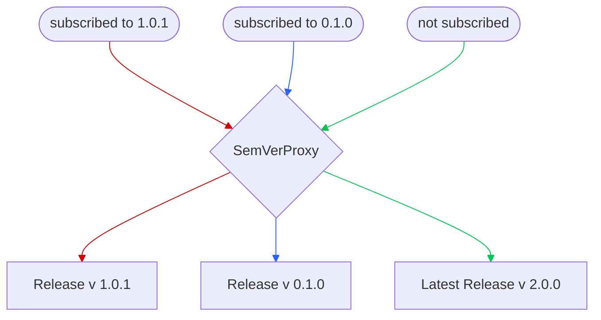

# SemVer Proxy
Proxy contract that allows dispatching calls to multiple implementations, based on [Semantic Versioning](https://semver.org/). Automatically handles incrementation of `major.minor.patch` parts of a version during upgrades, but it *doesn't enforce proper adherence to Semantic Versioning by developers on a smart-contract level* - it's considered to be a responsibility of a smart-contract developer to properly adhere to Semantic Versioning.

## Quick Start
```sh
git clone https://github.com/daoio/semver-proxy

## Install deps (note, oz contracts are already installed locally with --no-git)
forge install
## Run tests
forge test
```

## Storage layout of `SemVerProxy`
`SemVerProxy` reserves storage slots **0 to 99** for implementation contracts by declaring a fixed-size array that occupies these slots:
```solidity
uint256[100] private __gap; // Reserves slots 0-99 for implementations
```
So, the storage layout of a proxy and an arbitrary implementation contract can be represented as follows:
```text
Proxy storage layout:
┌─────────────┐
│ Slot 0-99   │ ← `__gap` placeholder (reserved for implementations)
├─────────────┤
│ Slot 100    │ ← `_latestVersion`
│ Slot 101    │ ← Other state variables
│ ...         │
└─────────────┘

Implementation storage example:
┌─────────────┐
│ Slot 0      │ ← Implementation's first state variable
│ Slot 1      │ ← Implementation's second state variable
│ ...         │
│ Slot 99     │ ← Last available slot for implementation
├─────────────┤
| Slot 100    | ← ⚠️ This will collide with proxy's storage
└─────────────┘
```

## Releases and Versioning
A **release** refers to a versioned implementation contract stored in the proxy. Unlike standard proxies, `SemVerProxy` maintains multiple implementations simultaneously, each accessible through its semantic version.

- **Latest Release**: Stored in the [ERC-1967 implementation slot](https://eips.ethereum.org/EIPS/eip-1967#logic-contract-address)  
  (Updating this overwrites the ERC-1967 slot)
- **Historical Versions**: Preserved in the `_releases` mapping  
  (All versions remain accessible to clients by their `major.minor.patch` identifier)
- **Initial Version**: `0.1.0` per [SemVer initial development guidelines](https://semver.org/#how-should-i-deal-with-revisions-in-the-0yz-initial-development-phase)

### Version Upgrade
Admins can release new version of implementation contract via the following function calls (effectively upgrading proxy to use new implemenation, though clients might still use previous versions of the implementation contract):

| Function  | Behavior | Example |
| ------------- | ------------- | -- |
| `releasePatch`  | Increments patch | `1.2.3` → `1.2.4` |
| `releaseMinor`  | Increments minor, resets patch | `1.2.3` → `1.3.0` |
| `releaseMajor`  | Increments major, resets minor and patch | `1.2.3` → `2.0.0` |

## Subscribing to Specific Versions
By default, all non-admin calls that end up in `fallback()` function are dispatched to `delegatecall` to the latest release (stored in ERC-1967 slot). But, users can "subscribe" to use the implementation version they need, by calling:
```solidity
function subscribeToVersion(Version memory version) external;

// Where {Version} is:
struct Version {
    uint64 major;
    uint64 minor;
    uint128 patch;
}
```
After this action all calls of a subscribed user will be dispatched to the `major.minor.patch` version they have specified for subscription. All subscriptions are stored inside `SemVerProxy._subscribedClients` mapping


Users can unsubscribe from using specific version and use the latest one by calling:
```solidity
function unsubscribeFromVersioning() external;
```

## Security Considerations
- Since `SemVerProxy` only reserves slots from 0 to 99, any 100+ slot of the implementation will collide with proxy.
- `SemVerProxy` has externally accessable function, therefore there's a possibiliy of function selector clash (i.e., if implementation defines functions that have the same signature as external functions of `SemVerProxy`).
